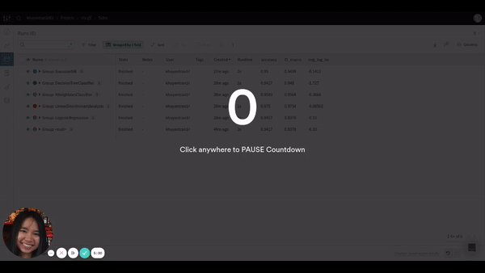

[](https://github.com/khuyentran1401/Data-science/tree/master/data_science_tools/wandb_tracking)

## Introduction to Weight & Biases: Track and Visualize your Machine Learning Experiments in 3 Lines of Code


Photo by [Solé Bicycles](https://unsplash.com/@solebicycles?utm_source=medium&utm_medium=referral) on [Unsplash](https://unsplash.com/?utm_source=medium&utm_medium=referral)

### Motivation

If you have applied machine learning or deep learning for your data science projects, you probably know how overwhelming it is to keep track and compare different experiments.

In each experiment, you might want to track the outputs when you change the model, hyperparameters, feature engineering techniques, etc. You can keep track of your results by writing them in an Excel spreadsheet or saving all outputs of different models in your Jupyter Notebook.

However, there are multiple disadvantages to the above methods:

-   You cannot record every kind of output in your Excel spreadsheet
-   It takes quite a bit of time to manually log the results for each experiment
-   You cannot keep all outputs of your experiments in one place
-   You cannot visually compare all outputs

What if there is a way to track and visualize all experiments like below in 3 lines of code?


This is when Weight & Biases becomes handy.

### What is Weight & Biases?

[Weight & Biases](https://www.wandb.com/) is a free Python library that allows you to track, compare, and visualize ML experiments. It is also integrated with many popular libraries such as TensorFlow, PyTorch, Kera, Scikit, Hugging Face, and XGBoost.

To install Weight & Biases, use

```bash
pip install wandb
```

Sign up for a free account by going to the [sign up page](https://wandb.ai/home). Then login using

```bash
wandb login
```

That’s it! Now you’re ready to use `wandb.`

### Get Started

In this tutorial, we will work with the famous Iris flower data set then use Weight & Biases to track the results.

```python
from sklearn.model_selection import cross_val_score
from sklearn import datasets
from sklearn.model_selection import train_test_split, StratifiedKFold
from sklearn.linear_model import LogisticRegression

# Load dataset
df = datasets.load_iris()
X = df.data 
y = df.target

# Split into train and test set
X_train, X_test, y_train, y_test = train_test_split(X, y, test_size=0.20, random_state=1)

# Instantiate the model
model = LogisticRegression(solver='liblinear', multi_class='ovr')

kfold = StratifiedKFold(n_splits=10, random_state=1, shuffle=True)

# Get metrics
accuracy = cross_val_score(model, X_train, y_train, cv=kfold, scoring='accuracy').mean()
f1_macro = cross_val_score(model, X_train, y_train, cv=kfold, scoring='f1_macro').mean()
neg_log_loss = cross_val_score(model, X_train, y_train, cv=kfold, scoring='neg_log_loss').mean()
```

To track the results, start with initializing the project

```python
import wandb

wandb.init(project='iris')
```

Now all outputs for this experiment will be saved under ‘iris’ project:


Then log all metrics using

```python
wandb.log({'accuracy': accuracy,
          'f1_macro': f1_macro,
          'neg_log_loss': neg_log_loss})
```

That’s it! Now we are ready to run our script.

```bash
python get_started.py
```

You should see something like this

```bash
wandb: Currently logged in as: khuyentran1401 (use `wandb login --relogin` to force relogin)
wandb: Tracking run with wandb version 0.10.12
wandb: Syncing run resilient-dragon-34
wandb: ⭐️ View project at https://wandb.ai/khuyentran1401/iris
wandb: 🚀 View run at https://wandb.ai/khuyentran1401/iris/runs/2jmvmemn

wandb: Run summary:
wandb:       accuracy 0.94167
wandb:       f1_macro 0.93782
wandb:   neg_log_loss -0.32999
wandb:          _step 0
wandb:       _runtime 1
wandb:     _timestamp 1609020166
wandb: Run history:
wandb:       accuracy ▁
wandb:       f1_macro ▁
wandb:   neg_log_loss ▁
wandb:          _step ▁
wandb:       _runtime ▁
wandb:     _timestamp ▁
```

If you click the link provided in the output, you should see something like below


The output now is a little bit boring since there is just one experiment. Let’s experiment with different models then compare them with one another.

### Compare Different Experiments

Start with initializing the model. This time, we will add `reinit=True` to allow reinitializing runs. We will also group the runs according to model to compare the outputs of different models.

```python
import wandb

def main(name_model, model):

    wandb.init(project='iris', 
                group=name_model, # Group experiments by model
                reinit=True
    )
```

Put everything together
```python
import wandb

def main(name_model, model):

    wandb.init(project='iris', 
                group=name_model, # Group experiments by model
                reinit=True
    )

    # code to get metrics
    ...

    # log metrics
    wandb.log({'accuracy': accuracy,
               'f1_macro': f1_macro,
               'neg_log_loss': neg_log_loss})

if __name__=='__main__':
    models = {'LogisticRegression': LogisticRegression(solver='liblinear', multi_class='ovr'),
            'LinearDiscriminantAnalysis': LinearDiscriminantAnalysis(),
            'KNeighborsClassifier': KNeighborsClassifier(),
            'DecisionTreeClassifier': DecisionTreeClassifier(),
            'GaussianNB': GaussianNB()}
    
    for name, model in models.items():
        main(name, model) 

```
Awesome! Let’s see how the outputs look

```bash
python many_models.py
```


Looks cool! Now we can compare the results of different runs by looking at the charts automatically created by `wandb` .

Since we are more interested in grouping the results by model, let’s adjust the grouping. The GIF below shows you how to do that.


After adjusting the grouping, you should see something like this:


It is much clearer now! Based on 3 charts, `LinearDiscrimnantAnalysis` seems to be the best model since it has the highest f1 macro score and accuracy and has the lowest negative log loss.

You can also view the results by clicking the table icon


It also allows you to hide or move columns or sort the table by a certain variable as shown below:


### Visualize Sklearn Models

`wandb` also allows us to create common plots to evaluate Sklearn models with built-in functions.

To visualize all classification plots, use:
```python
import wandb

wandb.sklearn.plot_classifier(model, X_train, X_test, y_train, y_test, 
                                y_pred, y_probas, features, model_name=name_model)
```                                

Run `python sklearn_model.py` , we should see 8 different classification plots for a run like below!


View all plots [here](https://wandb.ai/khuyentran1401/iris/runs/7vr53cmz?workspace=user-khuyentran1401). Find all possible plots and other integrations [here](https://docs.wandb.com/integrations/scikit).

### Save Model

If you want to reproduce the result, you need to save the model. `wandb` allows you to do that by using `wandb.save()`

Start with saving the model as a local file, then save it in `wandb`
```python
import pickle
import wandb

# Save model
pickle.dump(model, open('model.pkl', 'wb'))

wandb.save('model.pkl')
```
Click the run link, then click the Files tab, you should see something like this


In this tab, many files are automatically logged including summary, terminal outputs, config files, requirements.txt, and the model we have just saved.

Click the download button next to the model to download the model. When clicking the `model.pkl`, you should see information about your model as shown below:


[Model information](https://wandb.ai/khuyentran1401/iris/runs/2j4gbvsy/files/model.pkl)

You can also find other information about your run including the overview, charts, system, terminal logs, and files by clicking tabs on the left-hand side of the run.


[System information](https://wandb.ai/khuyentran1401/iris?workspace=user-sygnals)


Pretty cool, isn’t it?